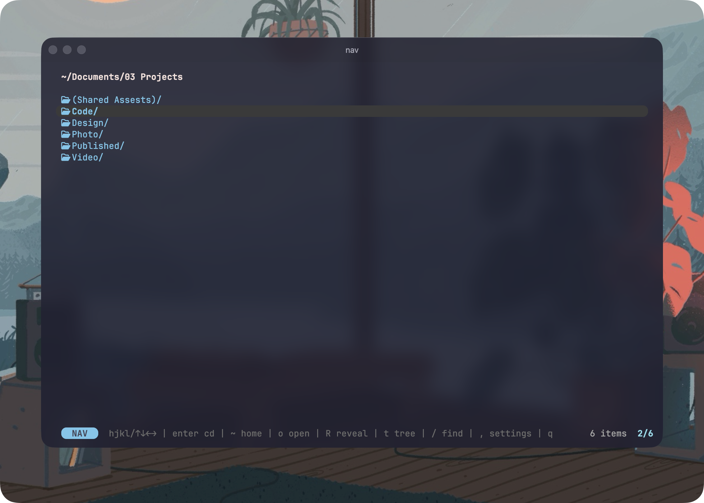
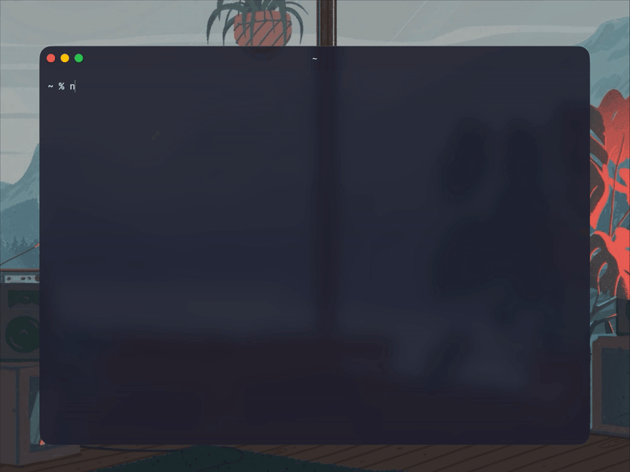

# nav

A tiny terminal file navigator. Browse folders with vim keys, press enter, and your shell `cd`s into it.

**Website:** [getnav.dev](https://getnav.dev)



<details>
<summary><b>▶︎ Watch the demo</b></summary>



</details>

## Install

### Homebrew

```sh
brew install TheGentleTurtle/tap/nav
```

### Go

```sh
go install github.com/TheGentleTurtle/nav@latest
```

### From source

```sh
git clone https://github.com/TheGentleTurtle/nav.git
cd nav
go build -o nav .
```

## Shell setup

The first time you run `nav`, it will set up a small shell wrapper automatically. This wrapper is what lets `nav` change your working directory — without it, `nav` can only display paths.

You can also run setup manually:

```sh
nav --setup
```

The wrapper it adds to your `~/.zshrc` or `~/.bashrc`:

```sh
# --- nav - terminal directory navigator ---
nav() {
  if [ $# -gt 0 ]; then
    command nav "$@"
    return
  fi
  local dir
  dir="$(NAV_WRAPPED=1 command nav)"
  if [ -n "$dir" ] && [ -d "$dir" ]; then
    cd "$dir"
  fi
}
# --- end nav ---
```

Then restart your shell or run `source ~/.zshrc`.

## Commands

```sh
nav             # open navigator — pick a folder and cd into it
nav --setup     # install/show shell wrapper setup
nav --help      # show help and keybindings
nav --version   # print version
nav --uninstall # remove wrapper and uninstall Homebrew formula
```

## Keys

| Key | Action |
|-----|--------|
| `hjkl` / `↑↓←→` | Navigate (cursor wraps) |
| `l` / `→` | Enter folder |
| `h` / `←` | Go back |
| `g` | Jump to top |
| `Enter` | **cd** — folder = into it; file = current dir |
| `Space` | cd into current directory (ignore cursor) |
| `o` | Open selected item in the default app |
| `R` | Reveal selected item in Finder |
| `t` | Show file tree (interactive view) |
| `c` | Copy path to clipboard |
| `~` | Jump to home |
| `[.]` | Toggle hidden files |
| `s` | Cycle sort: name → modified → size |
| `/` | Fuzzy search |
| `Esc` | Clear search |
| `,` | Open settings |
| `?` | Open help |
| `q` | Quit without changing directory |

## Tree

Press `t` on a folder to view its file tree. Inside tree view:

| Key | Action |
|-----|--------|
| `j` / `k` or `↑↓` | Scroll one line |
| `g` / `G` | Top / bottom |
| `←` / `→` | Decrease/increase depth (0 → ∞ → 0) |
| `f` | Toggle files vs folders only |
| `.` | Toggle hidden files |
| `i` | Toggle skip-ignored (node_modules, .git, etc.) |
| `m` | Toggle format: ASCII ↔ Markdown |
| `c` | Copy tree to clipboard |
| `S` | Save tree to file (.txt or .md) |
| `esc` / `q` | Back to file list |

Trees show up to 100,000 items.

## Settings

Press `,` inside nav to open a settings panel. Settings persist to `~/.config/nav/config.json`.

**Display**
- Show hidden files (default)
- Folders always on top
- Sort mode (default): name / modified / size
- Nerd Font icons — auto-detected on first run; toggle off if you see `??` boxes
- Shortcut hints — `none` / `minimal` (default) / `full` — controls how much keyboard help is shown in the bottom status bars

**Behavior**
- Smart Enter — when on, pressing Enter on a file opens it instead of cd'ing

**Tree defaults** (used when you press `t`)
- Default depth (0–10 or ∞)
- Include files
- Include hidden files
- Skip ignored (node_modules, .git, etc.)
- Format (ASCII or Markdown)

**Help** — also accessible directly with `?`

### Nerd Font

nav uses [Nerd Font](https://www.nerdfonts.com/) glyphs for file icons and the cursor pill. If your terminal isn't using a Nerd Font, those will render as `??` boxes. Two options:

1. **Install a Nerd Font**: e.g. `brew install --cask font-jetbrains-mono-nerd-font`, then set it as your terminal's font in preferences.
2. **Turn icons off** in nav's settings (`,` → Display → Nerd Font icons). nav still works perfectly — just no icons or rounded cursor ends.

nav auto-detects Apple Terminal (which usually doesn't have one) and defaults icons OFF. iTerm, WezTerm, Kitty, Alacritty default ON.

## License

[CC BY-NC 4.0](https://creativecommons.org/licenses/by-nc/4.0/) — free for personal use, no commercial use.